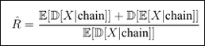

# Features

## Архитектуры нейронных сетей используемые в работе

* CNN - Convolution neural network
* GCNN - Group convolution neural network 
* Transformer c двумя видами attention (классический и без softmax, более плавный)
* PhaseTransformer - transformer с уточнением фазы с помощью QNN или GCNN
* EnergyBasedTransformer
* Sampler transformer - сэмплирование спинов из распределения трансформера
* FFN - Feedforward neural network
* SymmFFN - Group feedforward neural network
* QNN - Quantum neural network (в силу вычислительной сложности и сложности обучения имеет смысл использовать только в комбинации с другими НН для уточнения значения фазы и борьбы с застреванием в локальных минимумах при многоступенчатом обучении)
* TutorialVIT - Vision transformer из [туториала](https://netket.readthedocs.io/en/latest/tutorials/ViT-wave-function.html#ground-state-optimization) netket

## Проблема застревания в локальных минимумах

Метрика, на которую можно опираться, делая вывод о нахождении в локальном решении:

Из графиков сходимости энергии можно увидеть упорядоченность уровней и делать вывод о том, в каком эксперименте модель застряла в локальном минимуме.

### Способы борьбы с этой проблемой

* Ранняя остановка при обучении, когда метрика R_hat близка к еденице. Работает для простых моделей, которым требуется менее строгая регуляризация для устойчивого обучения.
* Учет симметрии
  - Учет симметрии преобразуя входные данные в НН. Симметрии mirror, Z2 для систем описываемых состояниями проекции спина по оси z.
  - Учет симметрии в весах модели (Group Neural Network). [1](https://disk.360.yandex.ru/i/RwOawrNH0S2bRA) [2](https://geometricdeeplearning.com/lectures/). Симметрия SO3 группы [3](https://e3nn.org/). В netket сейчас есть встроенная поддержка гильбертова пространства, дискретных состояний, дискретных чисел заполнения, ContinuousHilbert истинно непрерывных переменных (координаты, импульсы). В netket нет непрерывного представления спинов на сфере Блоха, готовых операторов для SU(2) спинов в непрерывном представлении, специализированных сэмплеры для сферы Блоха. В связи с этим учет симметрии SO3 группы для этого фреймворка требует дополнительной работы.
* Использовать Стохастическую Реконфигурацию [1](https://quantum-journal.org/papers/q-2025-07-22-1803/) [2](https://quantum-journal.org/papers/q-2023-10-10-1131/). В теории ускоряет сходимость и препятствует застреванию в локальных оптимумах. На практике для сложных моделей эффект слабо заметен.
* Использвовать методы преобразования гамильтониана:
  - Perturbation - добавить к исходному оператору небольшой "шум" или специально подобранное возмущение, которое снимет вырождение (H' = H + ε * V). Собственные значения, которые были равны (вырождены) или очень близки, обычно по-разному реагируют на возмущение V. Это приводит к их расщеплению. Если выбрать V случайным, можно быть уверенным, что с вероятностью 1 вырождение будет снято.
  - Power Transformation - вместо поиска собственных значений λ оператора H, мы ищем собственные значения оператора f(H). Функция f выбирается так, чтобы производная f'(x) была большой в области сгущения. Собственные векторы при таком преобразовании не меняются. Меняется только масштаб, в котором мы ищем их. Это делает метод очень популярным.
  - Shift-and-Invert - Вместо исходной задачи на собственные значения Hψ = λψ решить преобразованную задачу, где спектр "перевернут" и "растянут" вокруг целевой точки. Мы фиксируем точку σ near (рядом с) областью сгущения, которую хотим "разрежать". Затем решаем задачу на собственные значения для обратного оператора со сдвигом:
(H - σI)⁻¹ ψ = μ ψ.     Собственные векторы ψ остаются теми же.

    Собственные значения нового и старого операторов связаны как μ = 1 / (λ - σ).

    Ключевой эффект: Собственные значения λ, которые были близки к σ, превращаются в очень большие по модулю μ. Таким образом, то, что было сгущением в спектре H, становится хорошо разделенными экстремальными собственными значениями в спектре (H - σI)⁻¹. Алгоритмам (например, Ланцоша) гораздо проще найти несколько наибольших/наименьших собственных значений, чем различить близкие.
P. S. проблема в этих методик в том, что они убивают преимущество недиагонализации операторов при обучении НН анзаца волновой функции или превращает Sparse Matrix в плотную матрицу, что тоже сильно влияет на скорость вычислений.
* Использовать эвристики при обучении в виде изменяемого learning rate и динамического изменения оптимизатора в зависимости от хода обучения.

### Transfer learning

* В коде реализована возможность переносить параметры с моделей для других операторов. При применении этого подхода при обучении с плавным изменением поля h проблема с локальными оптимумами обостряется. Способ подмешивания к параметрам небольшого шума при переносе не дает решение проблемы. Возможно при учете симметрии в весах модели плотность состояний возле GS будет уменьшенна и это даст какой-то результат, на это указывает положительный эффект от учета симметрии с помощью преобразования входных данных и усреденения output нейронной сети в [работе](https://disk.360.yandex.ru/i/UYSnfIuY2fwhXA) Синченко
